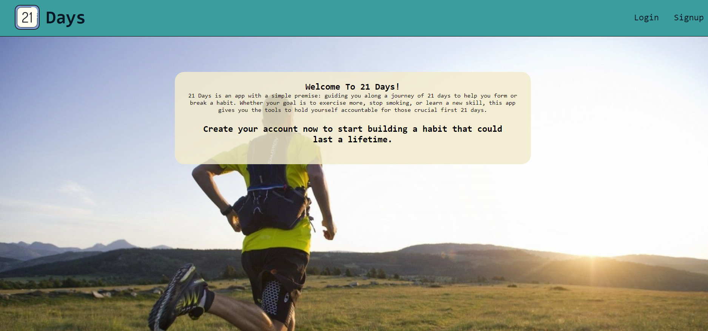

# 21 Days

## Description
21 Days is an app with a simple premise - It takes 21 days to build (or break) a habit. Whether your goal is to exercise more, stop smoking, or learn a new skill, this app gives you the tools to hold yourself accountable for those crucial first 21 days. Create your account now to start building a habit that could last a lifetime.

## Screenshot

## Deployed Application
https://lit-reaches-99655.herokuapp.com/

## Table Of Contents
* [Description](#description)
* [Installation](#installation)
* [Usage](#usage)
* [Credit](#credit)
* [Github](#github)
* [License](#license)

## Installation
Please use the following console command to install project dependancies: npm install

## Usage
Please follow these steps if you don't already have a profile created:
click on signup, fill out the signup form, and log in using your new information(for validation). From there you will be asked to add a habit. Do it. After that, you can update your habit at your leisure.

## Credit
Created By: 
Daryll Munoz: https://github.com/djamz919     
Daniel Natale: https://github.com/latenightdan 
Jeffrey Brittingham: https://github.com/JBGinger

## Github
Feel free to take a look at this project's Github repository at: https://github.com/djamz919/Track-My-Habits.

## License 
  Licensed Under: None  
  License Link: None
  
